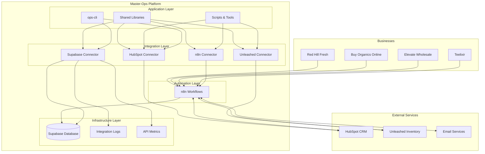
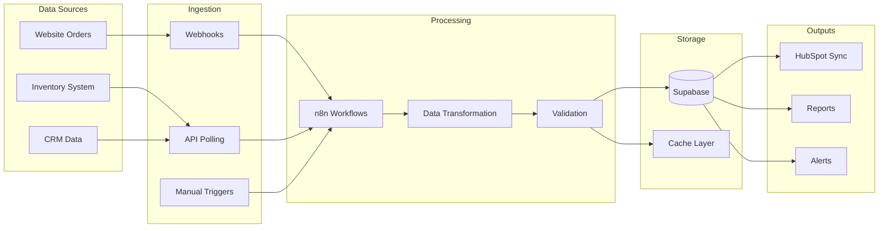
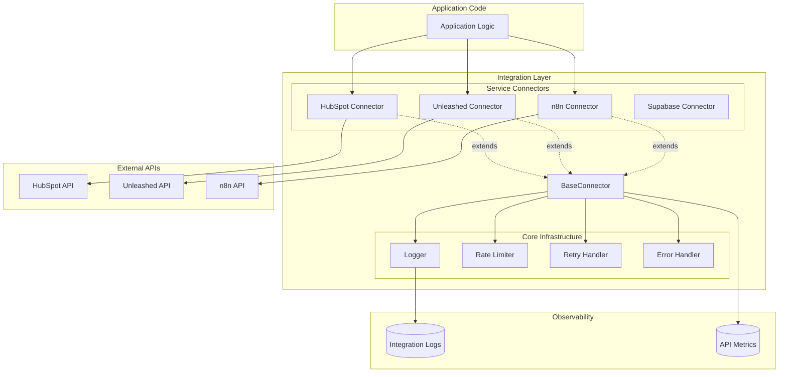
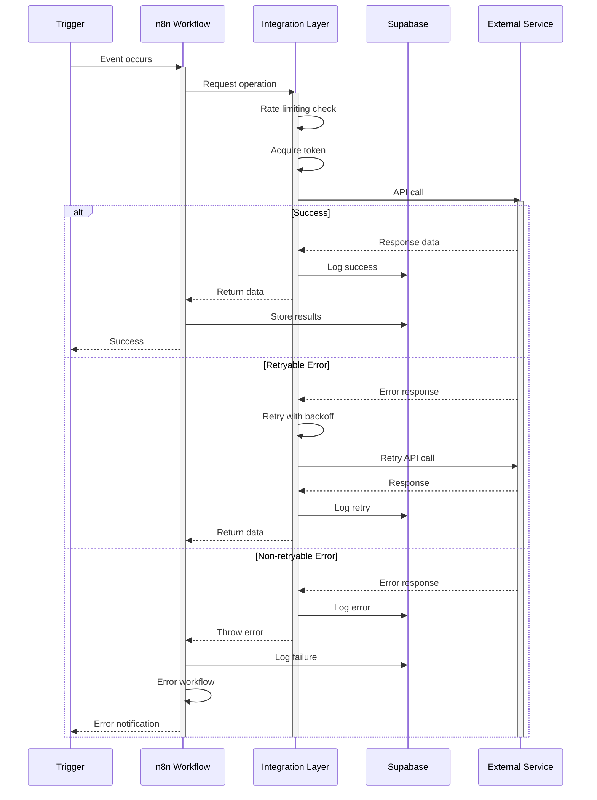
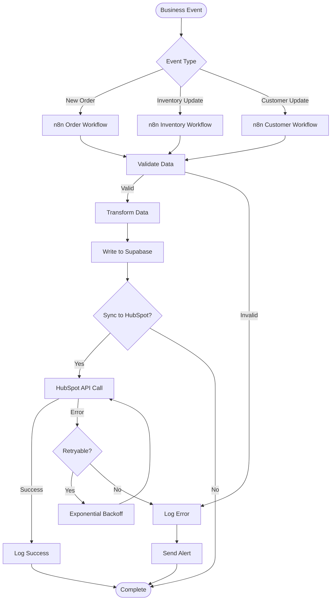
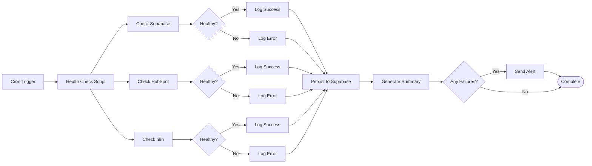
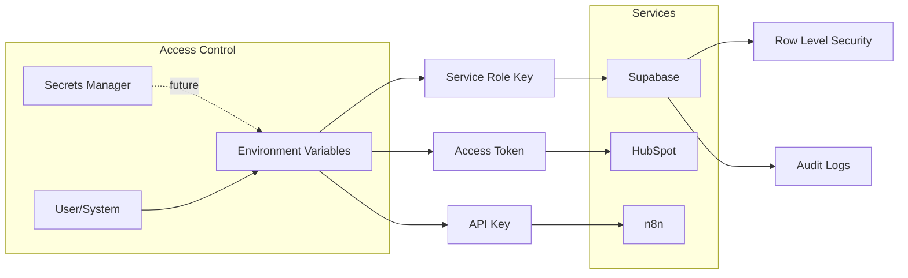
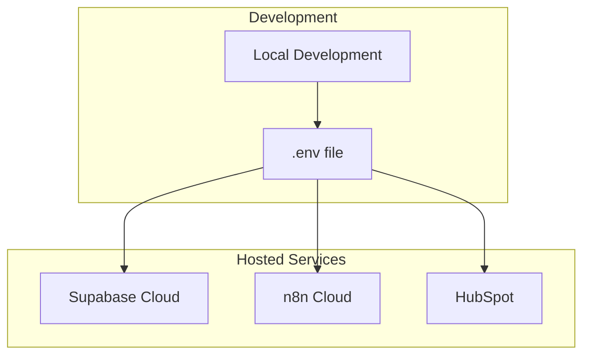
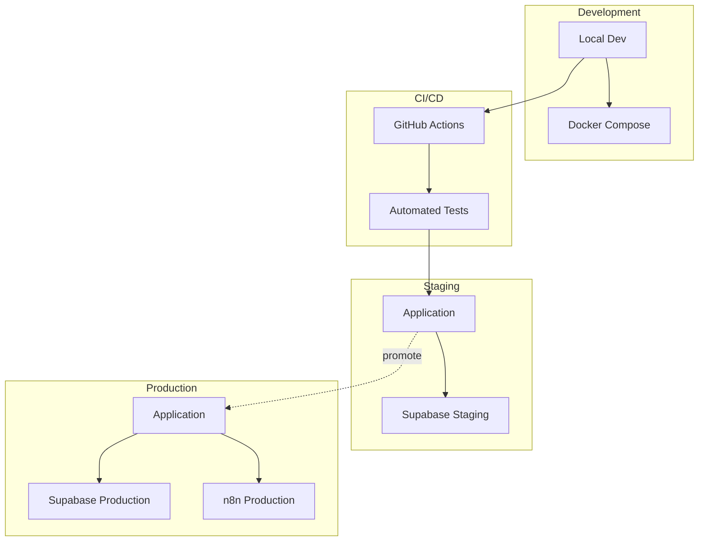

# Master-Ops Architecture Documentation

**Last Updated**: 2025-11-20

---

## Table of Contents

1. [System Overview](#system-overview)
2. [Architecture Diagrams](#architecture-diagrams)
3. [Component Details](#component-details)
4. [Data Flow](#data-flow)
5. [Integration Patterns](#integration-patterns)
6. [Security Architecture](#security-architecture)
7. [Deployment Architecture](#deployment-architecture)

---

## System Overview

Master-Ops is a centralized operations platform managing 4 businesses with shared infrastructure, integrations, and automation workflows.

### Core Principles

- **Single Source of Truth**: Supabase as primary data store
- **Automation First**: n8n workflows for business processes
- **Type Safety**: TypeScript throughout
- **Observability**: Centralized logging and monitoring
- **Reusability**: Shared libraries and components

### Technology Stack

| Layer | Technology | Purpose |
|-------|-----------|---------|
| **Database** | Supabase (PostgreSQL) | Primary data store, auth, real-time |
| **Automation** | n8n | Workflow orchestration |
| **CRM** | HubSpot | Customer relationship management |
| **Inventory** | Unleashed | Inventory management |
| **Runtime** | Node.js + TypeScript | Application logic |
| **CLI** | Commander.js | Developer tooling |
| **Monitoring** | Custom (Supabase-based) | Logging and health checks |

---

## Architecture Diagrams

### High-Level System Architecture



### Data Flow Architecture



### Integration Layer Architecture



### Workflow Orchestration



---

## Component Details

### 1. Integration Layer (`shared/libs/integrations/`)

Provides reusable, type-safe connectors for all external services.

**Components:**
- **BaseConnector**: Abstract class with rate limiting, retry logic, error handling
- **Rate Limiter**: Token bucket algorithm for API rate limiting
- **Retry Handler**: Exponential backoff retry mechanism
- **Error Handler**: Standardized error formatting and categorization
- **Logger**: Centralized logging with Supabase persistence

**Service Connectors:**
- `hubspot/client.ts` - HubSpot CRM integration
- `unleashed/client.ts` - Unleashed inventory (planned)
- `n8n/client.ts` - n8n workflow management (planned)
- `supabase/client.ts` - Supabase wrapper (exists in `infra/`)

### 2. Automation Layer (n8n)

Located in `infra/n8n-workflows/`

**Workflow Types:**
- **Data Sync**: Business → HubSpot, Inventory → Supabase
- **Order Processing**: Order creation, fulfillment tracking
- **Monitoring**: Health checks, error notifications
- **Reporting**: Scheduled reports, data exports

### 3. Data Layer (Supabase)

**Tables:**
- `tasks` - AI task tracking
- `task_logs` - Task execution logs
- `integration_logs` - Integration activity logs
- `workflow_execution_logs` - Workflow metrics
- `api_metrics` - API performance tracking

**Views:**
- `integration_health_summary` - Service health aggregation
- `workflow_performance_summary` - Workflow statistics
- `recent_errors` - Recent error logs
- `recent_workflow_failures` - Failed workflow executions

### 4. CLI Tools (`tools/`)

**ops-cli** - Main CLI interface:
- Health checks
- Log querying
- Database operations
- Statistics and reporting
- Workflow monitoring

**Health Checks** - Standalone monitoring:
- Service connectivity tests
- Response time tracking
- Automated alerting

### 5. Scripts (`scripts/`)

Organized by function:
- `tests/` - Integration tests
- `fixes/` - Data correction scripts
- `workflows/` - Workflow management
- `analysis/` - Diagnostic tools
- `sync/` - Data synchronization
- `auth/` - Authentication utilities

---

## Data Flow

### Business Data Sync Flow



### Health Check Flow



---

## Integration Patterns

### 1. Rate Limiting Pattern

All connectors implement token bucket rate limiting:

```typescript
// Configured per service
const hubspotClient = new HubSpotConnector({
  rateLimiter: {
    maxRequests: 100,  // Max requests
    windowMs: 10000,   // Per 10 seconds
  }
})
```

### 2. Retry Pattern

Exponential backoff with configurable retries:

```typescript
// Automatic retry on transient errors
const retry = new RetryHandler({
  maxRetries: 3,
  initialDelay: 1000,
  backoffMultiplier: 2,
  retryableStatusCodes: [408, 429, 500, 502, 503, 504]
})
```

### 3. Circuit Breaker Pattern

(Planned) Prevent cascading failures:

```typescript
// Future implementation
if (errorRate > threshold) {
  circuitBreaker.open()
  // Fail fast for period
}
```

### 4. Batch Processing Pattern

Process large datasets with concurrency control:

```typescript
const results = await connector.batchExecute(
  items,
  'processItem',
  async (item) => await process(item),
  { concurrency: 5, continueOnError: true }
)
```

---

## Security Architecture

### Authentication & Authorization



### Security Layers

1. **Network Security**
   - HTTPS only for all API calls
   - API keys in environment variables
   - No credentials in code

2. **Data Security**
   - Row Level Security (RLS) in Supabase
   - Service role key for server-side only
   - Audit logging for all data changes

3. **Access Control**
   - API key rotation (manual, automation planned)
   - Least privilege principle
   - Service-specific credentials

4. **Secrets Management**
   - Environment variables (`.env` gitignored)
   - Future: Vault integration for production

---

## Deployment Architecture

### Current State



### Planned State



---

## Future Enhancements

### Phase 1 (Current)
- ✅ Integration layer with rate limiting
- ✅ Centralized logging
- ✅ Health monitoring
- ✅ CLI tooling

### Phase 2 (Next)
- [ ] Complete all service connectors
- [ ] Enhanced n8n workflow library
- [ ] Automated testing suite
- [ ] Docker Compose dev environment

### Phase 3 (Future)
- [ ] API gateway
- [ ] GraphQL layer
- [ ] Real-time dashboards
- [ ] Advanced analytics
- [ ] Secrets rotation automation

### Phase 4 (Long-term)
- [ ] Multi-region deployment
- [ ] Advanced caching
- [ ] Message queue (Bull/Redis)
- [ ] Event sourcing
- [ ] CQRS pattern

---

## Appendix

### File Structure

```
master-ops/
├── infra/                      # Infrastructure
│   ├── supabase/              # Database schemas
│   ├── n8n-workflows/         # Workflow definitions
│   └── config/                # Service configurations
├── shared/                     # Shared resources
│   ├── libs/                  # Shared libraries
│   │   ├── logger.ts          # Centralized logging
│   │   └── integrations/      # Integration layer
│   │       ├── base/          # Base connectors
│   │       ├── hubspot/       # HubSpot connector
│   │       ├── unleashed/     # Unleashed connector
│   │       └── n8n/           # n8n connector
│   ├── prompts/               # AI prompts
│   └── specs/                 # Specifications
├── scripts/                    # Operational scripts
│   ├── tests/                 # Test scripts
│   ├── fixes/                 # Fix scripts
│   ├── workflows/             # Workflow scripts
│   ├── sync/                  # Sync scripts
│   └── auth/                  # Auth scripts
├── tools/                      # CLI tools
│   ├── ops-cli/               # Main CLI
│   └── health-checks/         # Health monitoring
├── teelixir/                   # Business: Teelixir
├── elevate-wholesale/          # Business: Elevate
├── buy-organics-online/        # Business: BOO
└── red-hill-fresh/             # Business: RHF
```

### Key Technologies

- **Runtime**: Node.js 18+, TypeScript 5.3+
- **Database**: Supabase (PostgreSQL 15+)
- **Automation**: n8n
- **Testing**: Vitest
- **CLI**: Commander.js
- **HTTP Client**: Native fetch API

---

**Document Version**: 1.0
**Last Updated**: 2025-11-20
**Maintained by**: Claude Code
